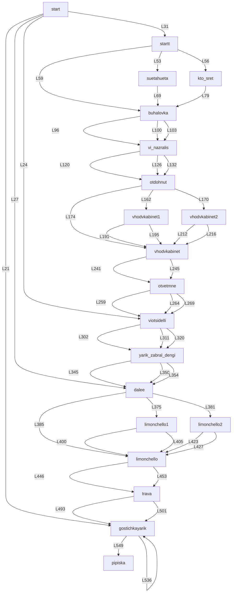

# Карта переходов

Карта всех явных `jump`; подпись ребра — строка исходника. Вложенные выборы и промежуточные реплики см. в [сценарии](STORY.md). Возвраты не показаны.

```mermaid
flowchart TD
    start["start"]
    startt["startt"]
    suetahueta["suetahueta"]
    kto_sret["kto_sret"]
    buhalovka["buhalovka"]
    vi_nazralis["vi_nazralis"]
    otdohnut["otdohnut"]
    vhodvkabinet1["vhodvkabinet1"]
    vhodvkabinet2["vhodvkabinet2"]
    vhodvkabinet["vhodvkabinet"]
    otvetmne["otvetmne"]
    viotsidelli["viotsidelli"]
    yarik_zabral_dengi["yarik_zabral_dengi"]
    dalee["dalee"]
    limonchello1["limonchello1"]
    limonchello2["limonchello2"]
    limonchello["limonchello"]
    trava["trava"]
    gostichkayarik["gostichkayarik"]
    pipiska["pipiska"]
    start -->|L21| gostichkayarik
    start -->|L24| viotsidelli
    start -->|L27| dalee
    start -->|L31| startt
    startt -->|L53| suetahueta
    startt -->|L56| kto_sret
    startt -->|L59| buhalovka
    suetahueta -->|L69| buhalovka
    kto_sret -->|L79| buhalovka
    buhalovka -->|L96| vi_nazralis
    buhalovka -->|L100| vi_nazralis
    buhalovka -->|L103| vi_nazralis
    vi_nazralis -->|L120| otdohnut
    vi_nazralis -->|L126| otdohnut
    vi_nazralis -->|L132| otdohnut
    otdohnut -->|L162| vhodvkabinet1
    otdohnut -->|L170| vhodvkabinet2
    otdohnut -->|L174| vhodvkabinet
    vhodvkabinet1 -->|L191| vhodvkabinet
    vhodvkabinet1 -->|L195| vhodvkabinet
    vhodvkabinet2 -->|L212| vhodvkabinet
    vhodvkabinet2 -->|L216| vhodvkabinet
    vhodvkabinet -->|L241| otvetmne
    vhodvkabinet -->|L245| otvetmne
    otvetmne -->|L259| viotsidelli
    otvetmne -->|L264| viotsidelli
    otvetmne -->|L269| viotsidelli
    viotsidelli -->|L302| yarik_zabral_dengi
    viotsidelli -->|L311| yarik_zabral_dengi
    viotsidelli -->|L320| yarik_zabral_dengi
    yarik_zabral_dengi -->|L345| dalee
    yarik_zabral_dengi -->|L350| dalee
    yarik_zabral_dengi -->|L354| dalee
    dalee -->|L375| limonchello1
    dalee -->|L381| limonchello2
    dalee -->|L385| limonchello
    limonchello1 -->|L400| limonchello
    limonchello1 -->|L405| limonchello
    limonchello2 -->|L423| limonchello
    limonchello2 -->|L427| limonchello
    limonchello -->|L446| trava
    limonchello -->|L453| trava
    trava -->|L493| gostichkayarik
    trava -->|L501| gostichkayarik
    gostichkayarik -->|L526| gostichkayarik
    gostichkayarik -->|L536| gostichkayarik
    gostichkayarik -->|L549| pipiska
```
